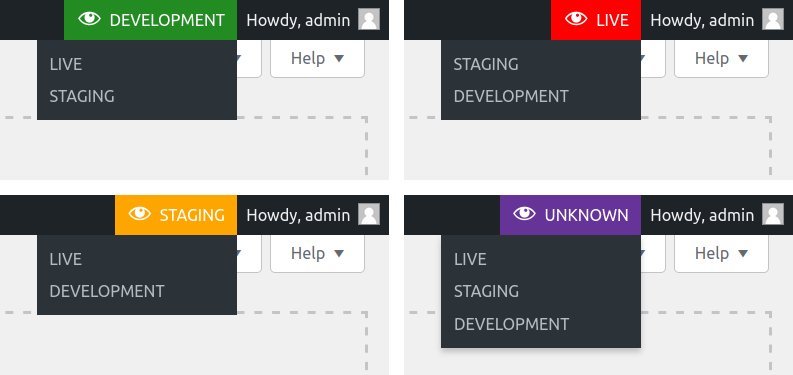

# Stage switcher for WordPress

This plugin adds a menu to the admin bar that helps quickly identify different environments for a site (e.g. production and development) and easily switch to the same URL on other environments. The plugin is multi-site compatible for both sub-domain and sub-directory installations.

## Installation

A bit of configuration is requiered for this plugin to function. There is no graphical UI so this has to be done using a PHP constant or a WordPress filter hook.

### Configuration using a PHP constant

Here's an example configuration array:

```php
define( 'DRGNFF_WP_STAGE_SWITCHER__ENVS', [
	'https://example.com' => [ // the array key is the home url
		'title' => 'LIVE', // display name
		'slug' => 'production', // unique ID
		'color' => '#FFFFFF', // hex color, optional
		'background_color' => '#FF0000', // hex color, optional
	],
	'http://example.localhost' => [
		'title' => 'DEVELOPMENT',
		'slug' => 'development',
		'color' => '#FFFFFF',
		'background_color' => '#228B22',
	],
]);
```

_Note:_ For multi-site subdomain installations use the URLs of the main site.

The name of the constant can be changed via the filter hook `drgnff_wp_stage_switcher__const_name`.

### Configuration using a WordPress filter hook

Hook to `drgnff_wp_stage_switcher__envs` and return an array similar to the one mentioned above in the PHP constant section.

### Controlling visibility of the switcher

By hooking to `drgnff_wp_stage_switcher__should_display_switcher` and returning a boolean you can control whether the switcher should be rendered. By default it's rendered for all logged in users.

### Overriding the default environment

By hooking to `drgnff_wp_stage_switcher__default_environment` you can control the title and colors for the default environment. The default environment (labeled as "UNKNOWN") is used when the current environment is not among the ones in the configuration.

## Development
Install development dependencies:
```sh
composer install
```

### Codestyle and linting
Check for codestyle violations:
```sh
composer run lint
```

Automatically fix codestyle violations:
```sh
composer run fix
```
### Tests
Run unit tests:
```sh
composer run test
```

Run unit tests continuously:
```sh
composer run watch
```

## Screenshots


