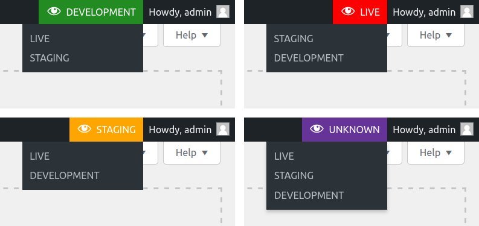
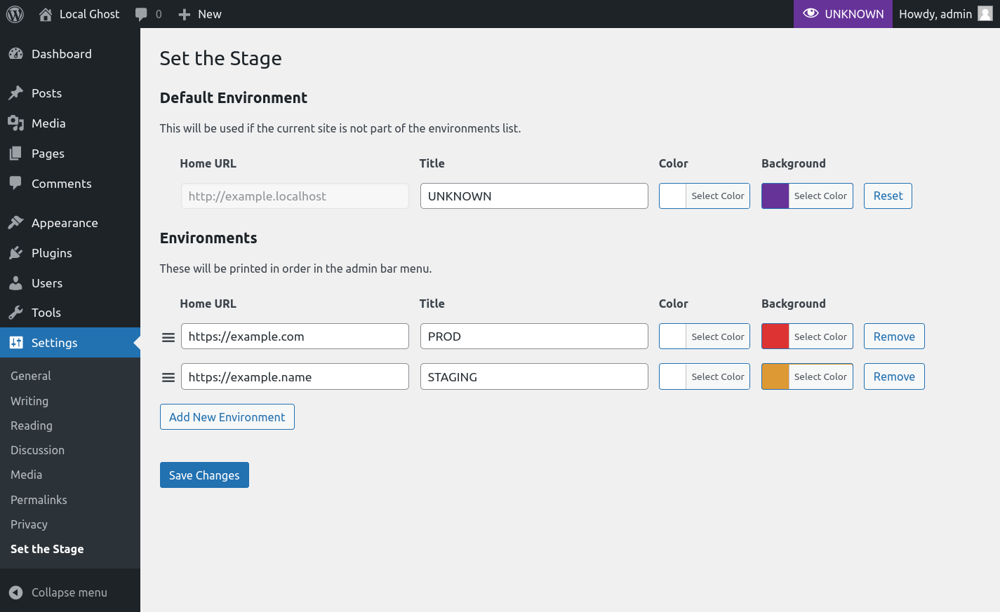
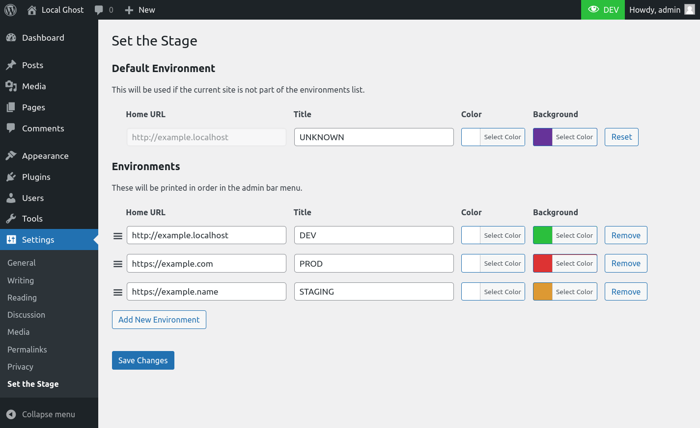

# Stage switcher for WordPress

Adds a menu to the admin bar to quickly identify different environments for a site (e.g. production and development) and easily switch to the same URL on other environments. Multi-site compatible for both sub-domain and sub-directory installations.



## Installation and configuration
Refer to the [plugin readme file](readme.txt).

## Development
Install development dependencies:
```sh
composer install
```

### Codestyle and linting
Check for codestyle violations:
```sh
composer run lint
```

Automatically fix codestyle violations:
```sh
composer run fix
```
### Tests
Run unit tests:
```sh
composer run test
```

Run unit tests continuously:
```sh
composer run watch
```

## Screenshots


The settings page


Adding the current environment to the list
